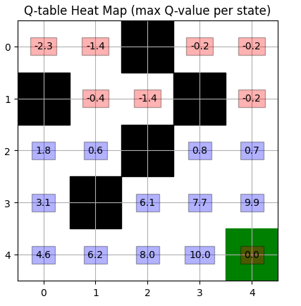
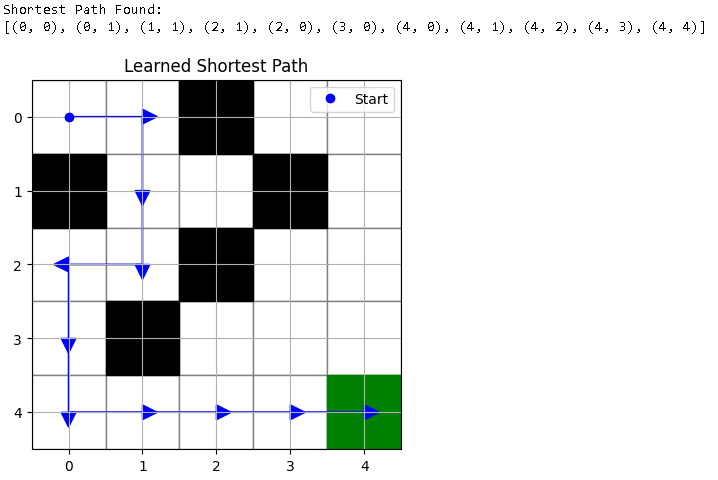

# Q-Learning Grid World AI

This project demonstrates a simple yet powerful reinforcement learning agent trained using the Q-learning algorithm to navigate through a 5x5 grid. The agent learns the optimal path from a start point to a goal point while avoiding obstacles and maximizing rewards.

---

## Project Overview

- Environment: 5x5 Grid World  
- Start Position: (0, 0)  
- Goal Position: (4, 4)  
- obstacles = (1, 0),(0, 2), (2, 2), (3, 1), (1, 3)
- Actions: Up, Down, Left, Right  
- Algorithm: Q-learning  
- Visual Output: Reward Plot, Heatmap of Q-table, Shortest Path

---

## Features

- Q-table-based learning  
- Epsilon-greedy strategy for exploration  
- Obstacle avoidance and reward shaping  
- Visualization of learning progress  
- Displays the shortest learned path after training  
- Easy customization for larger grids and additional obstacles

---

## Requirements

Install required packages using pip:

```bash
pip install numpy matplotlib
```

## Q-Learning Explanation
Q-learning is a reinforcement learning algorithm that learns the best action to take in a given state by updating a Q-table using the Bellman equation:

```css
Q(s, a) ← Q(s, a) + α * [r + γ * max(Q(s', a')) - Q(s, a)]
```
Where:
- s is the current state
- a is the action taken
- r is the reward received
- s' is the next state
- α is the learning rate
- γ is the discount factor
- max(Q(s', a')) is the best possible future reward

## Customization Options
You can easily customize the following parameters inside the code:

| Parameter       | Description                                |
|---------------- |--------------------------------------------|
| GRID_SIZE       | Size of the environment (e.g., 5x5, 10x10) |
| obstacles       | List of obstacle coordinates               |
| episodes        | Number of training episodes                |
| epsilon         | Starting exploration rate                  |
| epsilon_decay   | Decay rate for exploration                 |
| gamma           | Discount factor for future rewards         |
| lr              | Learning rate                              |

## Output
1. Reward per Episode
Shows how total reward per episode improves with learning.

2. Q-table Heatmap
Visualizes the max Q-value for each state in the grid. Helps understand which areas the agent values most.

3. Shortest Path
After training, the agent uses its Q-table to follow the path with the highest learned values from start to goal. Displayed as a path of * and labeled start (S) and goal (G).

Example output:






## Further Improvements
- Add animated visualization using Pygame or Tkinter
- Add more dynamic obstacles or moving enemies
- Extend to larger or randomly generated mazes
- Save and load Q-tables for persistent training
- Use deep Q-networks (DQN) for complex state spaces

## License
This project is licensed under the MIT License. You are free to use, modify, and distribute this project as needed.


